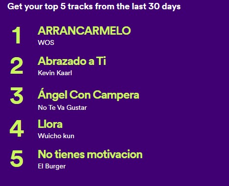

# JM_Portafolio
Data Science Portafolio
This Portfolio is a compilation of all the Data Science and Data Analysis projects I have done for academic, self-learning and hobby purposes. This portfolio also contains my Achievements, skills, and certificates. It is updated on the regular basis.

### Email: windesdex@gmail.com

### LinkedIn: https://www.linkedin.com/in/javier-martinez-guerrero/

## [Project 1:Analyzing Revenue and Ratings for Apple Apps Using SQL ](https://github.com/Winsdex/JM_Portafolio.html/blob/main/ProyectApple.sql) 

In today's digital age, mobile applications play a pivotal role in the success of technology companies. Apple's App Store is one of the largest platforms for distributing mobile apps, making it essential for developers and businesses to understand how their apps are performing in terms of revenue and user ratings. This project focuses on using SQL to analyze data related to revenue and ratings for Apple apps.

Objective:
The primary objective of this project is to analyze Apple app data using SQL queries to gain insights into revenue generation and user ratings. By examining this data, we aim to answer questions such as:

- What are the top-grossing apps on the Apple App Store?
- Are there any correlations between app ratings and revenue?
- How does the category of an app impact its revenue and ratings?
- Are there any trends or patterns in app performance over time?

Data Source:
To accomplish this project, i will need access to a dataset containing information about Apple apps, including details such as app name, category, user ratings, reviews, and revenue generated. You can obtain this data through various sources, such as public datasets, APIs, or by scraping data from the App Store (if permitted).

- Data Extraction: Gather the necessary data and import it into a SQL database. Ensure that the dataset includes all relevant information for analysis, such as app names, categories, user ratings, reviews, and revenue.

- Data Cleaning: Preprocess the data by handling missing values, removing duplicates, and ensuring data consistency.

- Data Exploration: Use SQL queries to explore the dataset and generate descriptive statistics. Identify key metrics, such as the average rating, total revenue, and distribution of apps across categories.

- top-Grossing Apps: Write SQL queries to identify the top-grossing apps on the Apple App Store. You can determine this by sorting apps based on their revenue.

- Correlation Analysis: Examine the relationship between user ratings and revenue using SQL queries and visualizations. Are highly-rated apps more likely to generate higher revenue?

- Category Analysis: Analyze how different app categories perform in terms of both revenue and ratings. Are certain categories more profitable or popular?

- Time Trends: Investigate how app performance has changed over time. Create SQL queries to track revenue and rating trends on a monthly or yearly basis.

By completing this project, i have gained valuable insights into the performance of Apple apps in terms of revenue and user ratings. These insights can be used by developers, businesses, and marketers to make informed decisions about app development, marketing strategies, and category selection.

## Proyect 2:Title: ETL for Spotify Personal Account - Most Listened Songs Databa 
Project Description:
This project aims to create an Extract, Transform, Load (ETL) process for your personal Spotify account. The goal is to build a database that stores information about the songs you listen to the most. By extracting your listening history from Spotify, transforming the data into a structured format, and loading it into a database, you can gain insights into your music preferences and trends.

Objective:
The primary objective of this project is to automate the collection and organization of your most-listened songs on Spotify. The ETL process will involve extracting your listening history, transforming it into a suitable database schema, and loading the data for analysis.

- [Data Extraction:](https://github.com/Winsdex/JM_Portafolio.html/blob/main/ExtracSpofity.py) Retrieve your listening history data from your Spotify account using Spotify's API or other authorized methods.

- [Data Transformation:](https://github.com/Winsdex/JM_Portafolio.html/blob/main/SpofityDrag.py) Clean and structure the data to create a database schema that includes attributes like song title, artist, play count, and date of listening.

- Database Creation: Set up a database (e.g., SQLite, MySQL) to store the transformed data.

- ETL Automation: Develop a script or workflow to automate the ETL process, ensuring that your most-listened songs are regularly updated in the database.

- Data Analysis (Optional): Use SQL queries or data visualization tools to analyze your listening patterns, identify favorite artists or genres, and track changes in your music preferences over time.

By completing this project, i have created a personalized database of your most-listened songs on Spotify, allowing you to gain valuable insights into your music preferences and habits. This ETL process can be a fun way to explore your musical journey and discover trends in your music consumption.

